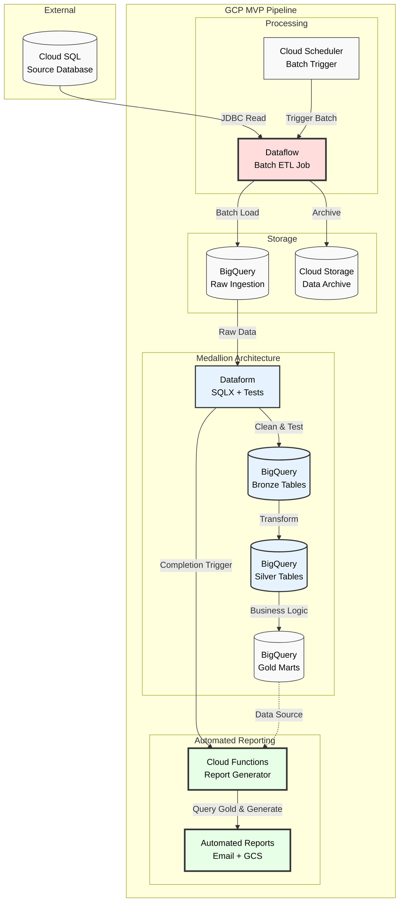

# Supermarket Sales Data Pipeline

A simplified ETL pipeline that extracts supermarket sales data from Kaggle, transforms it into a dimensional model, and generates analytical reports using external SQL files.

## Project Structure

```
66deg_project/
├── simple_pipeline.py            # Main ETL pipeline (all-in-one)
├── sql/                          # External SQL files
│   ├── create_tables.sql         # Database schema DDL
│   ├── report_sales_by_product.sql
│   ├── report_sales_by_store.sql
│   └── report_product_performance_by_city.sql
├── notebooks/                    # Jupyter demonstration
│   └── supermarket_sales_pipeline.ipynb
├── data/                         # Data storage (gitignored)
│   ├── supermarket_sales.db      # SQLite database
│   └── reports/                  # Generated CSV reports
├── requirements.txt              # Python dependencies
├── Dockerfile                    # Container definition
├── docker-compose.yml            # Development environment
└── .gitignore                    # Git ignore patterns
```

## Features

### Enhanced ETL Pipeline with Date/Time Analytics
- **Extract**: Kaggle API integration with intelligent data type detection
- **Transform**: Dimensional modeling (star schema) with proper date/time handling
- **Load**: SQLite database with DATE/TIME/DATETIME column types
- **Report**: Advanced temporal analytics with time-of-day, day-of-week, and monthly patterns

### Database Schema (Star Schema)
- **dim_product**: Product line with averaged pricing, cost, and margin data (6 unique products)
- **dim_store**: Store branch and city information (3 unique locations)
- **fact_sales**: Sales transactions with proper DATE/TIME/DATETIME columns and foreign keys (1000 transactions)

### External SQL Files
- All database creation SQL is in `sql/create_tables.sql`
- All analytical queries are in separate `.sql` files
- Supports complex joins and window functions
- Path resolution works from any working directory

## Quick Start

### Prerequisites
1. **Kaggle credentials**: Download `kaggle.json` from [Kaggle Settings](https://www.kaggle.com/settings)
   ```bash
   mkdir -p ~/.kaggle
   mv kaggle.json ~/.kaggle/
   chmod 600 ~/.kaggle/kaggle.json
   ```

### Using Docker (Recommended)
```bash
# Start Jupyter environment
docker-compose up

# Access notebook at: http://localhost:8888
```

### Local Installation
```bash
# Install dependencies
pip install -r requirements.txt

# Run complete pipeline
python3 simple_pipeline.py

# Or use Jupyter notebook
jupyter notebook notebooks/supermarket_sales_pipeline.ipynb
```

## Pipeline Steps

### 1. Extract
- Downloads dataset from Kaggle API with intelligent data type detection
- Handles both aggregated data (18 rows → expanded) and individual transaction data (1000 rows)
- Loads CSV into pandas DataFrame with proper column normalization

### 2. Transform  
- **Data Type Detection**: Distinguishes between aggregated vs individual transaction datasets
- **Date/Time Processing**: Converts to proper DATE, TIME, DATETIME column types
- **Dimensional Modeling**: Creates properly deduplicated dimension tables by product_line
- **Synthetic Data Generation**: Expands aggregated data with realistic temporal patterns when needed
- **Column Mapping**: Handles special characters (`Tax 5%` → `tax_5`)

### 3. Load
- Creates database schema from `sql/create_tables.sql` with proper DATE/TIME/DATETIME types
- Loads dimension tables first (referential integrity)
- Inserts fact table data with proper foreign keys and temporal columns

### 4. Report
- Executes advanced SQL queries from external `.sql` files with temporal analytics
- Generates comprehensive business intelligence reports with date/time insights
- Uses window functions, conditional aggregation, and statistical filtering
- Saves enhanced reports as CSV files in `data/reports/`

## Dataset

Uses [Supermarket Sales Dataset](https://www.kaggle.com/datasets/lovishbansal123/sales-of-a-supermarket):
- 1000 sales transactions
- 3 store branches (Yangon, Naypyitaw, Mandalay)
- 6 product categories
- Customer demographics and ratings

## Reports Generated

The pipeline generates comprehensive business intelligence reports with advanced date/time analytics:

### 1. **Sales by Product Line** (`sales_by_product_line.csv`)
Complete product performance analysis with temporal insights:
- **Core Metrics**: Transaction count, total revenue, average transaction value, customer ratings
- **Date Range Analysis**: First/last sale dates, active days, average daily revenue  
- **Time-of-Day Patterns**: Morning (9AM-12PM), afternoon (1PM-5PM), evening (6PM-9PM) performance
- **Business Value**: Identifies top-performing product categories and optimal selling times

**Sample columns**: `product_line`, `transaction_count`, `total_revenue`, `avg_rating`, `first_sale_date`, `last_sale_date`, `active_days`, `avg_daily_revenue`, `morning_avg_transaction`, `afternoon_avg_transaction`, `evening_avg_transaction`

### 2. **Sales by Store** (`sales_by_store.csv`)
Advanced store performance with rankings and trend analysis:
- **Performance Rankings**: Revenue-based store rankings using window functions
- **Running Totals**: Cumulative revenue analysis across all stores
- **Weekend vs Weekday**: Comparative analysis of weekend and weekday performance
- **Recent Performance**: Last 7 days revenue tracking for trend analysis
- **Geographic Insights**: City and branch performance comparison

**Sample columns**: `city`, `branch`, `transaction_count`, `total_revenue`, `revenue_rank`, `running_total`, `weekend_avg_transaction`, `weekday_avg_transaction`, `recent_7day_revenue`

### 3. **Product Performance by City** (`product_performance_by_city.csv`)
Cross-dimensional analysis with sophisticated temporal patterns:
- **Geographic Rankings**: Product performance rankings within each city
- **Monthly Trends**: Transaction counts by month (Jan/Feb/Mar analysis)
- **Peak Day Analysis**: Best performing day of week with weekend peak identification
- **Statistical Filtering**: Only includes combinations with 3+ transactions for significance
- **Multi-Dimensional Insights**: Product success varies by location and time

**Sample columns**: `product_line`, `city`, `transaction_count`, `city_rank`, `jan_transactions`, `feb_transactions`, `mar_transactions`, `best_day_of_week`, `sunday_peak`, `saturday_peak`

### **Advanced SQL Features Used**
- **Star Schema Joins**: Efficient fact-to-dimension table relationships
- **Window Functions**: `RANK() OVER()`, `SUM() OVER()` for rankings and running totals
- **Temporal Analytics**: `strftime()` functions for date/time pattern analysis
- **Conditional Aggregation**: `CASE WHEN` statements for time-based segmentation
- **Statistical Filtering**: `HAVING` clauses for data quality and significance
- **Partitioned Analytics**: `PARTITION BY` for city-specific rankings

## GCP Architecture



**Production MVP Architecture**: Batch ingestion from Cloud SQL via Dataflow, medallion architecture (bronze/silver/gold) with Dataform for data quality and testing, ending with automated report generation via Cloud Functions.

## Docker Environment

The project includes Docker configuration for consistent development:
- Python 3.9 with all required packages
- Jupyter notebook server on port 8888
- Volume mounting for live code editing
- Automated dependency installation