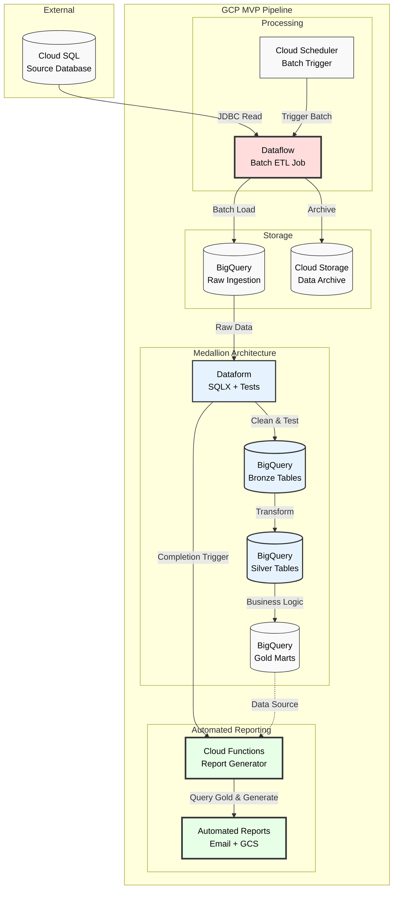

# Supermarket Sales Data Pipeline

A simplified ETL pipeline that extracts supermarket sales data from Kaggle, transforms it into a dimensional model, and generates analytical reports using external SQL files.

## Project Structure

```
66deg_project/
├── simple_pipeline.py            # Main ETL pipeline (all-in-one)
├── sql/                          # External SQL files
│   ├── create_tables.sql         # Database schema DDL
│   ├── report_sales_by_product.sql
│   ├── report_sales_by_store.sql
│   └── report_product_performance_by_city.sql
├── notebooks/                    # Jupyter demonstration
│   └── supermarket_sales_pipeline.ipynb
├── data/                         # Data storage (gitignored)
│   ├── supermarket_sales.db      # SQLite database
│   └── reports/                  # Generated CSV reports
├── requirements.txt              # Python dependencies
├── Dockerfile                    # Container definition
├── docker-compose.yml            # Development environment
└── .gitignore                    # Git ignore patterns
```

## Features

### Simplified ETL Pipeline
- **Extract**: Kaggle API integration for supermarket sales data
- **Transform**: Dimensional modeling (star schema)
- **Load**: SQLite database with external SQL schema
- **Report**: Automated reports using external SQL queries

### Database Schema (Star Schema)
- **dim_product**: Product line, pricing, cost, and margin data
- **dim_store**: Store branch and city information  
- **fact_sales**: Sales transactions with foreign key relationships

### External SQL Files
- All database creation SQL is in `sql/create_tables.sql`
- All analytical queries are in separate `.sql` files
- Supports complex joins and window functions
- Path resolution works from any working directory

## Quick Start

### Prerequisites
1. **Kaggle credentials**: Download `kaggle.json` from [Kaggle Settings](https://www.kaggle.com/settings)
   ```bash
   mkdir -p ~/.kaggle
   mv kaggle.json ~/.kaggle/
   chmod 600 ~/.kaggle/kaggle.json
   ```

### Using Docker (Recommended)
```bash
# Start Jupyter environment
docker-compose up

# Access notebook at: http://localhost:8888
```

### Local Installation
```bash
# Install dependencies
pip install -r requirements.txt

# Run complete pipeline
python3 simple_pipeline.py

# Or use Jupyter notebook
jupyter notebook notebooks/supermarket_sales_pipeline.ipynb
```

## Pipeline Steps

### 1. Extract
- Downloads dataset from Kaggle API
- Loads CSV into pandas DataFrame
- 1000 transaction records with 17 columns

### 2. Transform  
- Cleans and normalizes column names
- Creates dimension tables (products and stores)
- Builds fact table with foreign key relationships
- Handles column name mapping (`tax_5%` → `tax_5`)

### 3. Load
- Creates database schema from `sql/create_tables.sql`
- Loads dimension tables first (referential integrity)
- Inserts fact table data with proper foreign keys

### 4. Report
- Executes SQL queries from external `.sql` files
- Generates business reports with joins and window functions
- Saves results as CSV files in `data/reports/`

## Dataset

Uses [Supermarket Sales Dataset](https://www.kaggle.com/datasets/lovishbansal123/sales-of-a-supermarket):
- 1000 sales transactions
- 3 store branches (Yangon, Naypyitaw, Mandalay)
- 6 product categories
- Customer demographics and ratings

## Reports Generated

1. **Sales by Product Line**: Revenue and transaction analysis
2. **Sales by Store**: Performance ranking with window functions  
3. **Product Performance by City**: Cross-dimensional analysis

All reports use:
- SQL JOINs between fact and dimension tables
- Window functions (RANK, running totals)
- Aggregations and statistical functions

## GCP Architecture



**Production MVP Architecture**: Batch ingestion from Cloud SQL via Dataflow, medallion architecture (bronze/silver/gold) with Dataform for data quality and testing, ending with automated report generation via Cloud Functions.

## Docker Environment

The project includes Docker configuration for consistent development:
- Python 3.9 with all required packages
- Jupyter notebook server on port 8888
- Volume mounting for live code editing
- Automated dependency installation